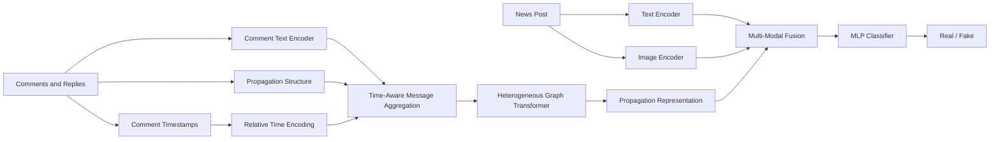

# TAFND

Official implementation of the ICONIP 2026 accepted paper:

**TAFND: Time-Aware Comment Propagation Network for Multi-Modal Fake News Detection**

TAFND is a multi-modal fake news detection framework that jointly models **news text**, **news images**, and **user comment propagation patterns**. In particular, TAFND explicitly incorporates the temporal information of comment propagation into a heterogeneous graph neural network to capture how discussion patterns evolve after a post is published.

The implementation supports experiments on **Fakeddit** and **Weibo**, including text-image baselines, comment-propagation baselines, and the proposed time-aware model.

---

## Overview

Fake news detection based only on the content of a post may overlook useful signals contained in subsequent user discussions. Comments and replies naturally form a propagation structure, while their timestamps provide additional information about how the discussion evolves over time.

TAFND models a news item using three complementary sources of information:

* **Text modality** — semantic representation of the original post.
* **Image modality** — visual representation of the accompanying image.
* **Comment propagation modality** — a heterogeneous comment-reply graph with temporal information.

The overall pipeline can be summarized as:



---

## Model Architecture

### 1. Multi-Modal Content Representation

For every news post, TAFND first extracts text and image representations using pretrained Transformer models.

The current implementation uses 768-dimensional representations for both modalities:

$$
\mathbf{h}_{text} \in \mathbb{R}^{768},
\qquad
\mathbf{h}_{image} \in \mathbb{R}^{768}.
$$

The post representation used in the propagation graph is obtained by concatenating the two features:

$$
\mathbf{h}_{post}
=
[\mathbf{h}_{text};\mathbf{h}_{image}]
\in
\mathbb{R}^{1536}.
$$

The default pretrained encoders are:

| Dataset  | Text Encoder              | Image Encoder                |
| -------- | ------------------------- | ---------------------------- |
| Fakeddit | `roberta-base`            | `vit-base-patch16-224-in21k` |
| Weibo    | `chinese-roberta-wwm-ext` | `vit-base-patch16-224-in21k` |

The pretrained models are used as feature extractors and are frozen during feature extraction.

---

### 2. Comment Propagation Graph

Each news item is represented as a heterogeneous graph containing two types of nodes:

```text
post
 ├── comment
 ├── comment
 │    └── reply
 │         └── reply
 └── comment
```

The graph contains:

**Node types**

```text
post
comment
```

**Edge types**

```text
(comment, comments_on, post)
(comment, replies_to, comment)
```

Each comment is represented by a text embedding generated from the corresponding pretrained language model.

The resulting graph is represented using PyTorch Geometric `HeteroData`.

Conceptually:

```text
HeteroData
│
├── post
│   ├── x              : [N_post, 1536]
│   ├── text_feature   : [N_post, 768]
│   ├── image_feature  : [N_post, 768]
│   └── y
│
├── comment
│   └── x              : [N_comment, 768]
│
├── comment --comments_on--> post
│   ├── edge_index
│   └── edge_time
│
└── comment --replies_to--> comment
    ├── edge_index
    └── edge_time
```

---

### 3. Time Encoding

TAFND explicitly models when each comment or reply is generated.

For every propagation edge, its timestamp is first converted into a relative time with respect to the publication time of the original post.

The relative timestamp is then transformed into a fixed-dimensional sinusoidal representation:

$$
\mathbf{t}_{e}
=
[
\sin(\Delta t_e \omega_1),
\cos(\Delta t_e \omega_1),
\ldots,
\sin(\Delta t_e \omega_d),
\cos(\Delta t_e \omega_d)
].
$$

The default time embedding dimension is:

```text
time_feature_dim = 64
```

This produces temporal features for both:

```text
comment -> post
comment -> comment
```

edges.

---

### 4. Time-Aware Comment Propagation

The main component of TAFND is implemented in:

```text
TreeModule/hgt_propagation_time_aggr.py
```

Instead of directly passing comment representations into the graph network, TAFND first learns a temporal importance weight for each propagation edge.

For an edge \(e\), the temporal weight is computed as:

$$
\alpha_e
=
\sigma(W_t \mathbf{t}_e + b_t),
$$

where \(\mathbf{t}_e\) denotes the temporal embedding and \(\sigma\) is the sigmoid function.

The comment message is then re-weighted:

$$
\mathbf{m}_e
=
\alpha_e \mathbf{h}_{comment}.
$$

TAFND learns separate temporal weighting functions for:

```text
comment -> post
comment -> comment
```

relations.

The weighted messages are aggregated into their destination nodes. Thus, comments generated at different stages of the propagation process can contribute differently to the final propagation representation.

---

### 5. Heterogeneous Graph Propagation

After time-aware message aggregation, the updated heterogeneous graph is processed by a two-layer **Heterogeneous Graph Transformer (HGT)**:

```text
Time-Aware Aggregation
        |
        v
     HGTConv
        |
       ReLU
        |
        v
     HGTConv
        |
        v
Enhanced Post Representation
```

The HGT module jointly models the heterogeneous relations between posts, comments, and replies.

The output corresponding to the `post` node is used as the final comment-propagation representation:

$$
\mathbf{h}_{propagation}
\in
\mathbb{R}^{768}.
$$

---

### 6. Multi-Modal Fusion and Classification

Finally, the three representations are concatenated:

$$
\mathbf{h}_{fusion}
=
[
\mathbf{h}_{text};
\mathbf{h}_{image};
\mathbf{h}_{propagation}
].
$$

With the default configuration:

$$
768 + 768 + 768 = 2304.
$$

The fused representation is passed through an MLP classifier:

```text
Text Feature ───────────┐
                        │
Image Feature ──────────┼── Concatenation ── MLP ── Real / Fake
                        │
Propagation Feature ────┘
```

The final task is binary fake news classification.

---

## Experimental Variants

The repository contains three main model configurations for each dataset.

| Variant     | Text | Image | Comment Graph | Temporal Information |
| ----------- | :--: | :---: | :-----------: | :------------------: |
| Two-modal   |   ✓  |   ✓   |               |                      |
| Three-modal |   ✓  |   ✓   |       ✓       |                      |
| **TAFND**   |   ✓  |   ✓   |       ✓       |           ✓          |

The two-modal model evaluates content-only fake news detection.

The three-modal model introduces a heterogeneous comment propagation graph using standard HGT.

TAFND further introduces temporal edge encoding and time-aware comment propagation.

---

## Repository Structure

```text
TAFND/
│
├── DataModule/
│   ├── data_preprocess.py
│   ├── load_data.py
│   ├── load_graph.py
│   ├── comment_graph_create_fakeddit.py
│   ├── comment_graph_create_fakeddit_time.py
│   ├── comment_graph_create_weibo_time.py
│   │
│   ├── data/
│   │   └── Pre-extracted .pt features and graph files
│   │
│   └── dataset/
│       ├── fakeddit/
│       └── weibo/
│
├── Models/
│   ├── concat_model.py
│   │   ├── Two-modal models
│   │   └── Non-temporal three-modal models
│   │
│   ├── temporal_model.py
│   │   └── TAFND models
│   │
│   └── trainer.py
│       └── Training and evaluation
│
├── TreeModule/
│   ├── hgt_propagation.py
│   │   └── Standard HGT propagation
│   │
│   └── hgt_propagation_time_aggr.py
│       └── Time-aware comment propagation + HGT
│
├── PretrainedModels/
│   └── Local pretrained Transformer models
│
├── Utils/
│   └── args.py
│
├── train_fakeddit_twomodal.py
├── train_fakeddit_threemodal.py
├── train_fakeddit_threemodal_time.py
│
├── train_weibo_twomodal.py
├── train_weibo_threemodal.py
├── train_weibo_threemodal_time.py
│
├── environment.yml
└── README.md
```

> **Note:** Python imports and data paths in the implementation use `DataModule`. On case-sensitive systems such as Linux, please make sure that the directory name is also exactly `DataModule`.

---

## Requirements

The experimental environment is provided in `environment.yml`.

The main dependencies include:

```text
Python 3.10
PyTorch 2.5.1
CUDA 12.1
PyTorch Geometric 2.6.1
torch-scatter 2.1.2
torch-sparse 0.6.18
Transformers 4.49.0
scikit-learn 1.6.1
```

The complete dependency list can be found in `environment.yml`.

Create the environment with:

```bash
conda env create -f environment.yml
```

Then activate it:

```bash
conda activate llm
```

---

## Pretrained Models

The current implementation loads pretrained models from the local directory:

```text
PretrainedModels/
```

The expected structure is approximately:

```text
PretrainedModels/
├── roberta-base/
├── chinese-roberta-wwm-ext/
└── vit-base-patch16-224-in21k/
```

For Fakeddit:

```text
Text  : roberta-base
Image : vit-base-patch16-224-in21k
```

For Weibo:

```text
Text  : chinese-roberta-wwm-ext
Image : vit-base-patch16-224-in21k
```

Make sure that the corresponding pretrained Hugging Face models are available under these directories before feature extraction.

---

## Data

The experiments are conducted on:

* **Fakeddit**
* **Weibo**

Due to the large size of the original datasets and the extracted `.pt` feature files, the complete processed datasets are not included directly in this repository.

A limited set of demo files is provided for reference.

The expected dataset structure is:

```text
DataModule/
├── dataset/
│   ├── fakeddit/
│   │   ├── data_json/
│   │   │   ├── train.json
│   │   │   ├── val.json
│   │   │   └── test.json
│   │   └── ...
│   │
│   └── weibo/
│       ├── data_json/
│       │   ├── train.json
│       │   ├── val.json
│       │   └── test.json
│       └── ...
│
└── data/
    ├── fakeddit_train.pt
    ├── fakeddit_test.pt
    ├── fakeddit_train_graph.pt
    ├── ...
    ├── weibo_train.pt
    └── ...
```

The preprocessing scripts automatically generate intermediate text/image embeddings and graph representations when the required processed files are unavailable.

---

## Running Experiments

### Fakeddit

#### Text + Image

```bash
python train_fakeddit_twomodal.py
```

#### Text + Image + Comment Graph

```bash
python train_fakeddit_threemodal.py
```

#### TAFND

```bash
python train_fakeddit_threemodal_time.py
```

---

### Weibo

#### Text + Image

```bash
python train_weibo_twomodal.py
```

#### Text + Image + Comment Graph

```bash
python train_weibo_threemodal.py
```

#### TAFND

```bash
python train_weibo_threemodal_time.py
```

---

## Training

The models are trained using cross-entropy loss:

$$
\mathcal{L}
=
-\sum_{c} y_c \log p_c.
$$

The current implementation uses:

```text
Optimizer          : Adam
Loss               : CrossEntropyLoss
Learning scheduler : CosineAnnealingLR
```

Default configurations differ between datasets.

### Fakeddit

```text
Batch size        : 128
Epochs            : 100
Learning rate     : 1e-4
Hidden dimension  : 768
HGT heads         : 8
Dropout           : 0.5
```

### Weibo

```text
Batch size        : 64
Epochs            : 30
Learning rate     : 2e-3
Hidden dimension  : 768
HGT heads         : 8
Dropout           : 0.5
```

The provided experiment scripts repeat experiments across multiple random seeds and report the mean and standard deviation of the evaluation metrics.

---

## Evaluation

The implementation reports the following metrics:

```text
Accuracy
Precision
Recall
F1 Score
```

Metrics are separately reported for the fake-news and real-news classes.

For repeated experiments, results are reported in the form:

$$
\text{mean} \pm \text{standard deviation}.
$$

---

## Implementation Pipeline

```text
Raw News Data
     |
     +-------------------------+
     |                         |
     v                         v
 Text Encoder              Image Encoder
     |                         |
     v                         v
Text Embedding            Image Embedding
     |                         |
     +------------+------------+
                  |
                  v
          Post Representation
                  |
                  |
Comments ---------+
   |
   v
Comment Encoder
   |
   v
Comment Embeddings
   |
Propagation Relations + Timestamps
   |
   v
Relative Time Encoding
   |
   v
Time-Aware Message Weighting
   |
   v
Heterogeneous Comment Graph
   |
   v
2-Layer HGT
   |
   v
Propagation Representation
   |
   +------------------------------+
                                  |
Text Embedding -------------------+
                                  |
Image Embedding ------------------+
                                  |
                                  v
                        Multi-Modal Fusion
                                  |
                                  v
                            MLP Classifier
                                  |
                                  v
                           Real / Fake News
```

---

## Citation

If you find this repository useful in your research, please cite our paper:

```bibtex
@inproceedings{tafnd2026,
  title     = {TAFND: Time-Aware Comment Propagation Network for Multi-Modal Fake News Detection},
  booktitle = {International Conference on Neural Information Processing (ICONIP)},
  year      = {2026}
}
```

The complete BibTeX entry will be updated after the official publication information becomes available.

---

## Acknowledgements

This implementation is built with:

* [PyTorch](https://pytorch.org/)
* [PyTorch Geometric](https://pyg.org/)
* [Hugging Face Transformers](https://huggingface.co/docs/transformers/)

We thank the authors and maintainers of these open-source projects.

---

## Contact

For questions regarding the implementation, please open an issue in this repository.
